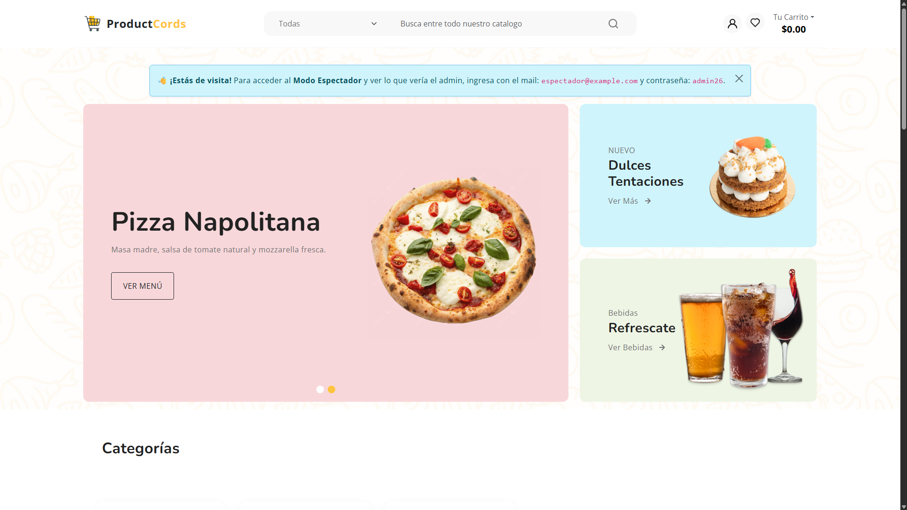
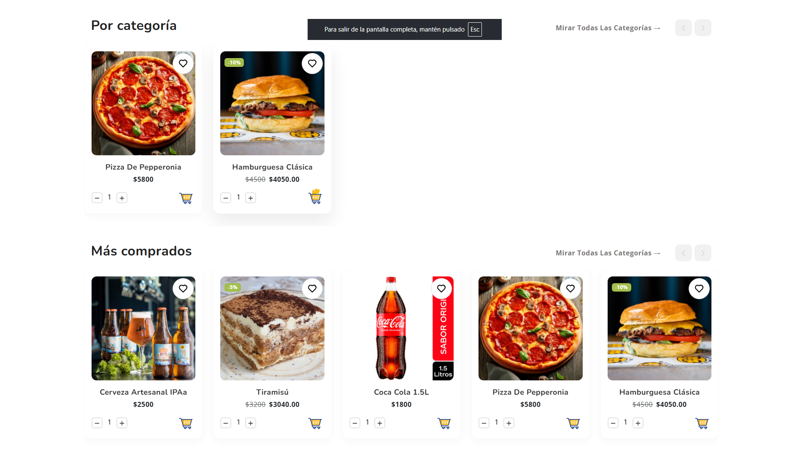
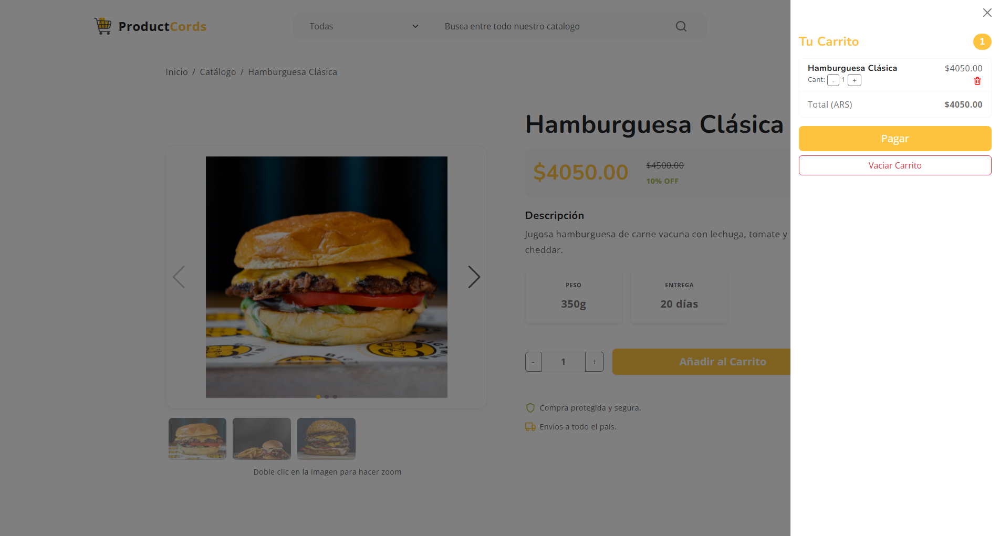
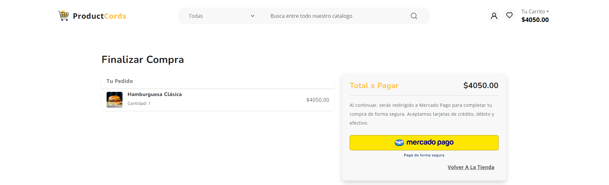

# [Nombre de tu Proyecto, ej: TechStore E-commerce] 🛒


## 🚀 Descripción
Desarrollo de una plataforma de comercio electrónico Full Stack simulando un entorno de producción real. El objetivo principal del proyecto fue implementar una arquitectura escalable separando el cliente (Frontend) y el servidor (Backend), integrando una pasarela de pagos funcional.

Este proyecto forma parte de mi portfolio personal como estudiante de Ingeniería en Sistemas, demostrando habilidades en el manejo de estado, APIs RESTful y servicios cloud.

**🔗 Live Demo:** [https://tu-proyecto.vercel.app](https://tu-proyecto.vercel.app)

---

## 🛠 Tech Stack

### Frontend (Cliente)
* **React.js:** Construcción de interfaces dinámicas y reutilizables.
* **Vite:** Empaquetado y optimización de entorno de desarrollo.
* **CSS Modules / Tailwind:** [Poné lo que usaste] para el diseño responsive.
* **React Router:** Navegación SPA (Single Page Application).

### Backend (Servidor)
* **Node.js & Express:** Creación de API REST y manejo de rutas.
* **Mercado Pago SDK:** Integración de pasarela de pagos (Modo Sandbox/Producción).
* **CORS & Dotenv:** Seguridad y manejo de variables de entorno.

### Base de Datos & Despliegue
* **MongoDB (Atlas):** Base de datos NoSQL para persistencia de productos y órdenes.
* **Vercel:** Despliegue del Frontend.
* **Render:** Despliegue del Backend (Web Service).

---

## ✨ Funcionalidades Principales

1.  **Catálogo de Productos:** Visualización dinámica de items traídos desde la base de datos.
2.  **Carrito de Compras:** Lógica de negocio para agregar, eliminar y calcular totales en tiempo real.
3.  **Checkout con Mercado Pago:** Integración completa que permite generar preferencias de pago y redirigir al usuario de forma segura.
4.  **Gestión de Stock:** [Si lo hiciste, ponelo aquí] Validación de disponibilidad.
5.  **Diseño Responsive:** Adaptable a móviles y escritorio.

---

## 📸 Capturas de Pantalla

| Home Page | Productos | Carrito | Checkout
|:---:|:---:|:---:|:---:|
|  |  |  |  


*(Nota: Estas imágenes demuestran el flujo de usuario)*

---

## 🔧 Instalación y Ejecución Local

Si deseas correr este proyecto en tu máquina local:

1.  **Clonar el repositorio**
    ```bash
    git clone [https://github.com/tu-usuario/tu-repo.git](https://github.com/tu-usuario/tu-repo.git)
    cd tu-repo
    ```

2.  **Configurar Variables de Entorno**
    Crea un archivo `.env` en la carpeta del servidor con las siguientes variables:
    ```
    PORT=5173
    MONGO_URI=tu_string_de_conexion
    MP_ACCESS_TOKEN=tu_token_de_mercado_pago
    ```

3.  **Instalar dependencias y correr**
    
    *Backend:*
    ```bash
    cd server
    npm install
    npm start
    ```

    *Frontend:*
    ```bash
    cd client
    npm install
    npm run dev
    ```

---

## 📬 Contacto

Si tienes sugerencias o quieres contactarme:
* **LinkedIn:** https://www.linkedin.com/in/ciro-cordara/
* **Email:** cirocordara@gmail.com

---
© 2026 Desarrollado por Ciro Cordara